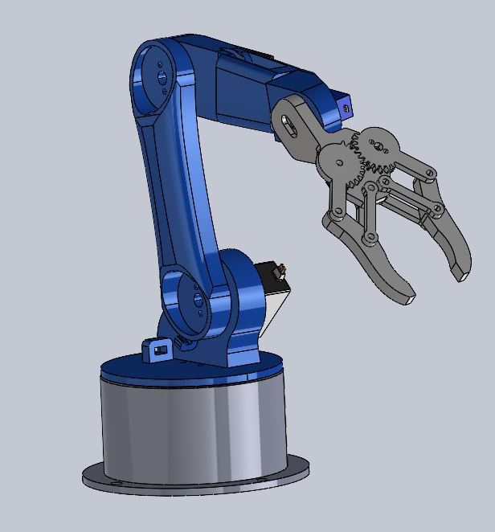

## Contents:
<ol>
   <li><a href="https://s-nithish-kumar.github.io/Design_of_CNC_Laser_Cut_Friendly_Robot_Arm/#1-problem-statement">Problem Statement</a></li>
   <li><a href="https://s-nithish-kumar.github.io/Design_of_CNC_Laser_Cut_Friendly_Robot_Arm/#2-objective">Objective</a></li>
   <li><a href="https://s-nithish-kumar.github.io/Design_of_CNC_Laser_Cut_Friendly_Robot_Arm/#3-impact-of-solving-the-problem">Impact of Solving the Problem</a></li>
   <li><a href="https://s-nithish-kumar.github.io/Design_of_CNC_Laser_Cut_Friendly_Robot_Arm/#4-redesigned-3d-model">Redesigned 3D Model</a></li>
   <li><a href="https://s-nithish-kumar.github.io/Design_of_CNC_Laser_Cut_Friendly_Robot_Arm/#5-results-and-conclusion">Results and Conclusion</a></li>
</ol>

### 1. Problem Statement:
- A 5+1 DoF Robot Arm is manufactured by 3D printing, and the manufacturing time and cost had a huge impact on the organization’s profit.
+ It takes almost three days to print all the components of a Robot Arm. The time consumed and the filament cost are found to cap the organization’s profit margin despite their high production volumes.

Figure 1 Existing 3D Printed 5+1 DoF Robot Arm

### 2. Objective:
- To design a 3+1 DoF Robot Arm as per the organization’s needs, which can be manufactured by CNC Laser Cutting Technology.
- To make the assembly easier and reduce the assembly time by a well-structured Design for Assembly.

### 3. Impact of Solving the Problem:
- The team will be able to manufacture the parts required for the Robot assembly in about an hour.
- Similar components can be manufactured at the same time, which reduces material waste.
- The replacement cost of any of the damaged parts will be less.

### 4. Redesigned 3D Model:
- The existing 5+1 DoF Robot arm has been redesigned to a 3+1 DoF arm considering easy design for manufacturing and assembly.
- Slots are provided in the links for routing the cables from Servo motors.

Figure 2 CNC Laser Cut Friendly 3+1 DoF Robot Arm

### 5. Results and Conclusion:
- 3D printing is a good choice for prototyping and the production of small and low quantity components.
- For mass manufacturing, other manufacturing methods like Die casting and CNC Laser Cutting can be used, which reduces manufacturing time and cost.
- Reading through the assembly instructions, the user will be able to assemble the Robot on their own.
- The organization will be able to reduce the product price and increase their profit margin too.

